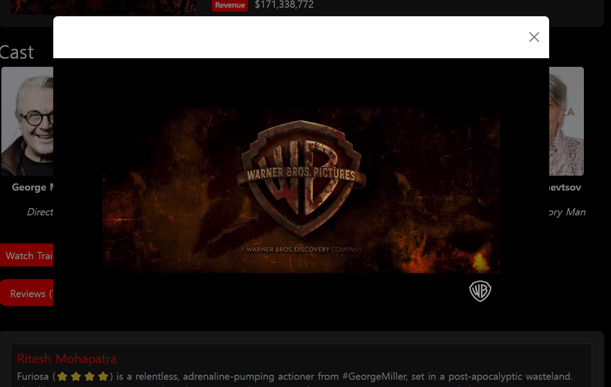

# 🎬 Find Your Favorite Movies at a Glance with SUNGFLIX

>  

**SUNGFLIX** is a website where you can view various movie information at a glance.

>  

## Deployment Address

> 
Frontend Server: https://sj-sungflix-demo.netlify.app/

## Project Introduction

**SungFlix** is designed to provide basic information about movies before you watch them.

- Helps users easily search for movies.
- Provides detailed information and related movies.
- Plans to integrate with movie ticketing sites in the future.
   

## Developer

|  |
| :----------------------------------------------------------------------------------------: |
|              Sung U Jung [@SungJung0616](https://github.com/SungJung0616)              |

 

## 📚 STACKS

### Environment

 

### Config

### Development

  

### Deployment

 

## Adopted Development Technologies and Branch Strategy

**React**

- Considered future maintenance and
- Saved resources by componentizing frequently used parts like user banners, top, and bottom banners.

**Redux Query**

- Efficient state management and API interaction.

### Branch Strategy

- Operated master, develop, and feature support branches based on the Git-flow strategy.
- Divided into master, develop, and feature branches for development.
- The master branch is used only for deployment stages.
- The develop branch acts as the master branch in the development stage of Git-flow.
- The feature branches are used for independent development environments by function and are deleted after merging.

## Project Structure

### Development Period

- Total development period: 2024-05-16 ~ 2024-05-30
- Frontend and feature implementation: 2024-05-22 ~ 2024-05-30

## Screen Configuration

### Main Screen

### All Movies

### Movie Detail

### Preview

### Casting & Review

 

## ⭐ Key Features

### 1. Movie Search

- Search by name, category, genre, and release date.

### 2. Movie Information

- Provides movie titles, ratings, production costs, directors, cast, trailers, reviews, posters, and more.

 

## How to Use

1. Search for the desired movie on the homepage.
2. Click on the movie poster to view detailed information.
3. Check related recommended movies.
4. You can also search by genre or release date.
